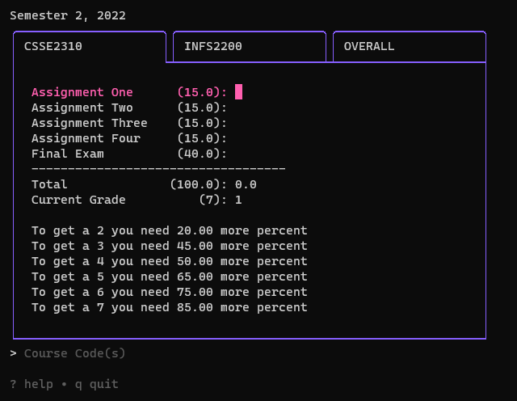

# UQ Grade Calculator

A [Bubble Tea][bubbletea] based CLI that can calculate your grades and let you
know how many more marks you need.

Course assessment information is fetched from UQ's Course Profile's using [Colly][colly]



## Setup

```sh
git clone https://github.com/jedwillick/uqgrade.git
cd uqgrade
go build
./uqgrade --help
```

[bubbletea]: https://github.com/charmbracelet/bubbletea
[colly]: https://github.com/gocolly/colly
